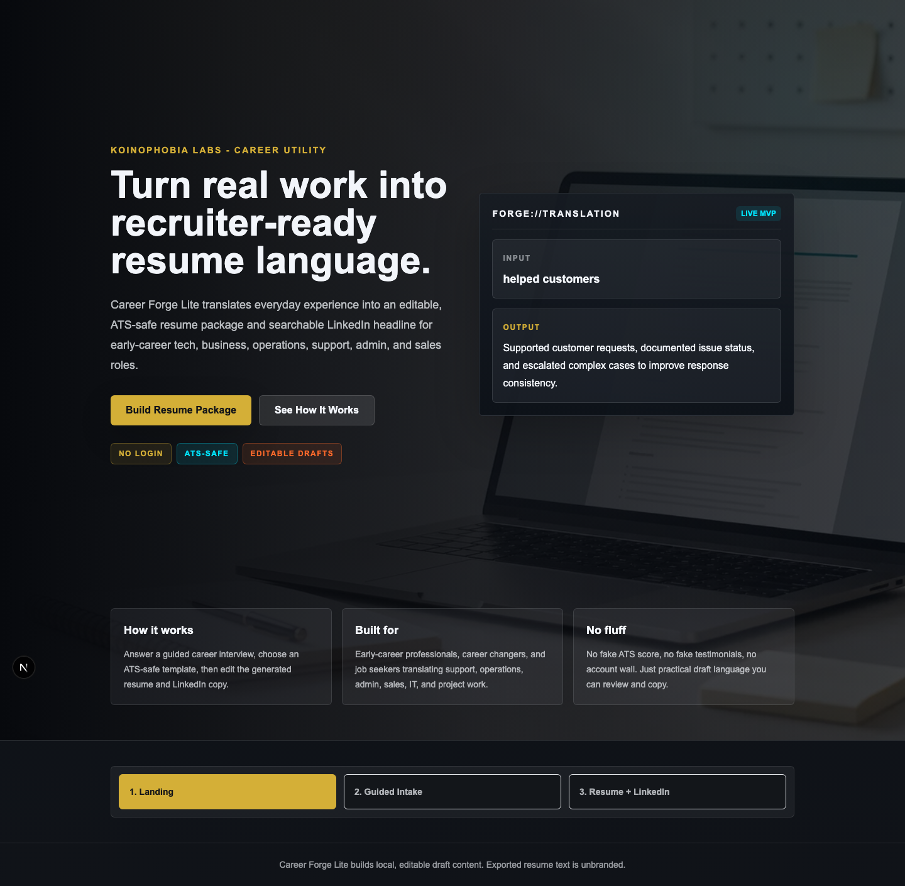
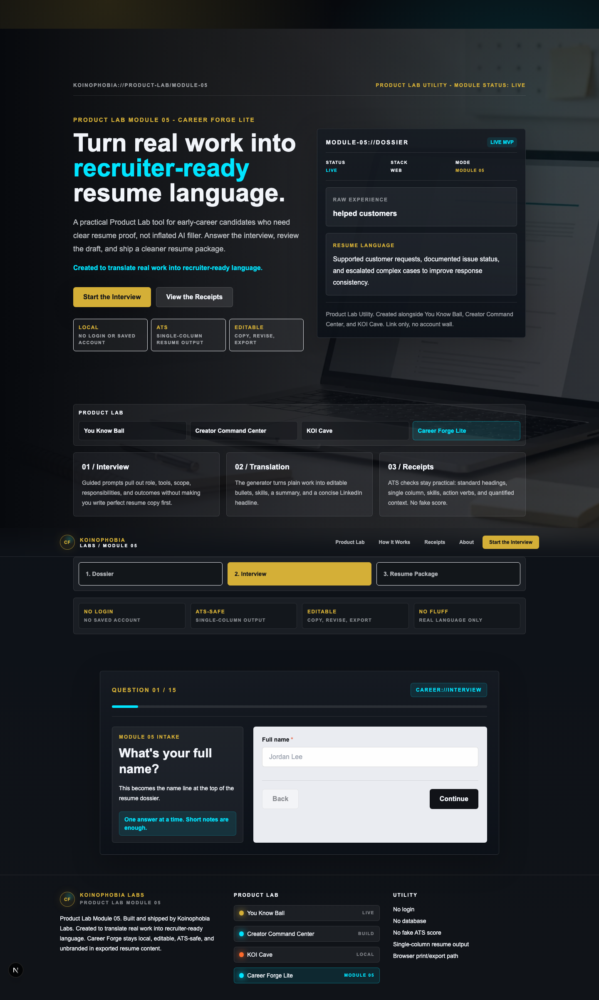
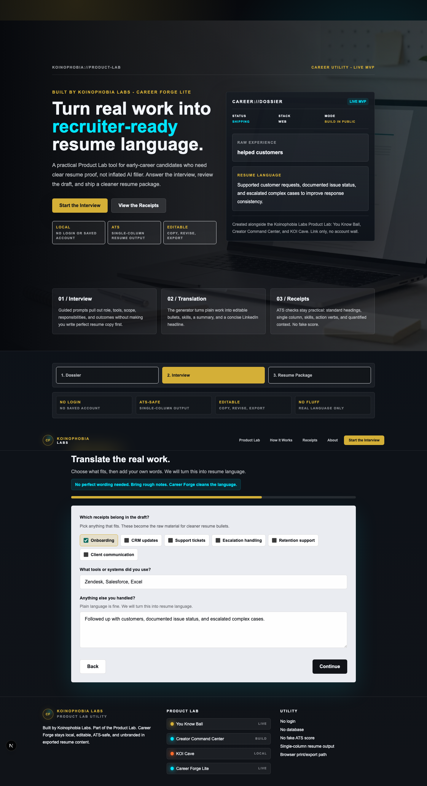
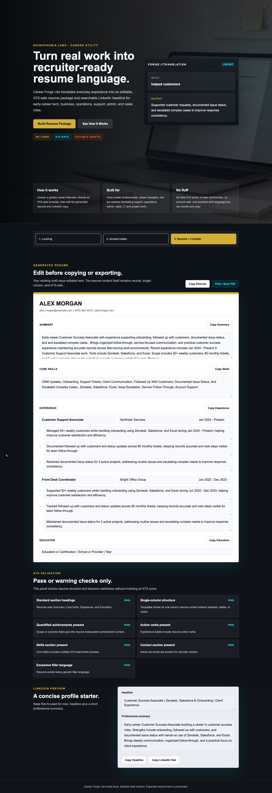
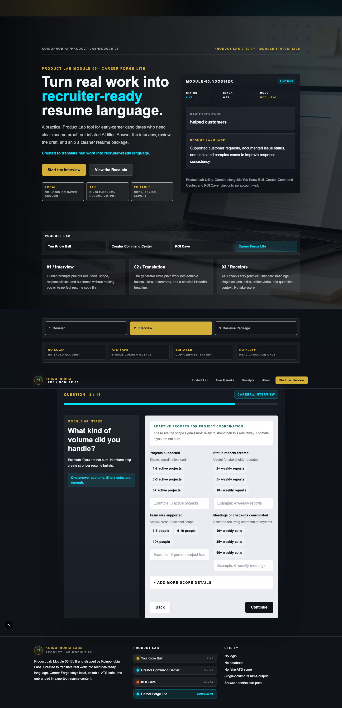
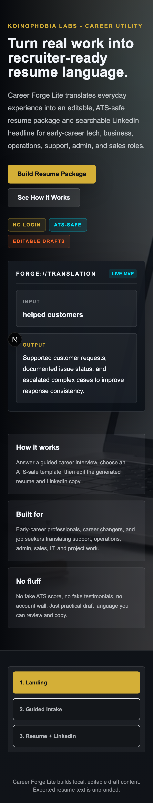

# Career Forge

Career Forge is a career transition command center. It turns a job search into a working system: a durable career profile, target role lanes with explicit positioning, application tailoring against real job posts, outreach with follow-up scheduling, an applications pipeline, and a dashboard that always surfaces the next best action. The original guided resume builder remains a core station inside the loop.

**Positioning:** Run your job search like an operation, not a lottery.

All command-center data persists in browser localStorage — no accounts, no backend, nothing uploaded.

## Command center stations

| Route | Station | What it does |
| --- | --- | --- |
| `/` | Dashboard | The loop, live stats, follow-ups due, and the single next best action |
| `/profile` | Career profile | Situation, target roles, transferable skills, strengths, constraints, proof points |
| `/targets` | Target lanes | 9-lane library (AI Support, Trust & Safety, Fraud/Risk Ops, Community, Product Support, QA, Product Ops, Customer Success, Technical Support) with fit rationale, resume angle, proof, and gaps — plus custom lanes |
| `/tailor` | Application tailoring | Deterministic job-post analysis: keywords, requirements vs. profile, weak spots, honest bullet rewrite suggestions |
| `/applications` | Pipeline | Status tracking with automatic follow-up scheduling |
| `/outreach` | Outreach | Contact tracking, message templates, and a two-follow-up cadence |
| `/resume-builder` | Resume builder | The original guided intake → ATS-safe resume package flow |
| `/story`, `/interview` | Story + interview modes | Free-text intake parsing and interview practice |

The interface uses a Koinophobia Labs-inspired trust design: dark, premium framing for the product experience with clean white work surfaces for resume editing and review.

## Screenshots













## Problem Solved

Early-career candidates often have useful experience but struggle to describe it in resume language. Career Forge Lite helps translate role, tools, responsibilities, scope, and outcomes into a clean single-column resume draft and LinkedIn headline without requiring accounts, payments, or a saved profile.

## Target Users

- Early-career and associate-level candidates
- Tech, business, operations, customer success, admin, sales, project coordination, and IT support applicants
- Candidates who need a practical, ATS-safe resume starting point they can edit quickly

## Features

- Landing page with clear product positioning
- Koinophobia Labs-inspired trust design with proof-led landing content
- Sample transformation showing weak input rewritten into resume-ready language
- Hybrid guided onboarding flow with grouped steps:
  - Contact
  - Target
  - Experience
  - Responsibilities
  - Scope + Outcomes
  - Template
- Searchable career target database with 67 mapped early-career role titles
- Guided responsibility suggestions based on role family
- Role intelligence system for Security, Customer Success, Project Coordination, Operations, Business, Sales, Admin, Tech, and IT Support
- Up to three experience roles:
  - Current or most recent role
  - Previous role
  - Optional additional role
- Free-text support for tools, responsibilities, and measurable outcomes
- Structured scope collection for customers, tickets, projects, team support, calls, revenue, and reports
- Outcome collection for speed, accuracy, customer satisfaction, revenue, retention, efficiency, reliability, and compliance
- ATS validation checks with pass/warning results and no fake score
- Three ATS-safe template styles: Corporate, Modern ATS, and Tech ATS
- Deterministic mock resume generator that works without an AI API key
- Input normalization for weak target roles, title casing, tools, companies, and resume header names
- Stronger output generation for summaries, ATS skills, resume bullets, and LinkedIn text
- Editable generated resume sections:
  - Summary
  - Core Skills
  - Experience
  - Education placeholder
- Editable LinkedIn headline and short professional summary
- Copy buttons for full resume, individual resume sections, LinkedIn headline, and LinkedIn text
- Print / Save PDF button as a lightweight export path
- Local state only

## Project Status

MVP foundation ready for GitHub and Vercel deployment. The app is intentionally local-state only: no accounts, database, payments, job matching, or native shell.

## Tech Stack

- Next.js
- TypeScript
- Tailwind CSS
- App Router
- React local state

## Setup

```bash
npm install
npm run dev
```

Open [http://localhost:3000](http://localhost:3000).

## Local Run Instructions

1. Install dependencies:

```bash
npm install
```

2. Start the development server:

```bash
npm run dev
```

3. Open the local app:

```text
http://localhost:3000
```

4. Verify production readiness:

```bash
npm run lint
npm run typecheck
npm run build
```

## Scripts

```bash
npm run dev
npm run lint
npm run build
npm run start
npm run typecheck
```

## Project Structure

```text
src/app
  globals.css
  layout.tsx
  page.tsx
src/components
  CopyButton.tsx
  IntakeForm.tsx
  LandingPage.tsx
  LinkedInPreview.tsx
  ResumePreview.tsx
  ATSValidationPanel.tsx
src/lib
  ats.ts
  career-data.ts
  generator.ts
src/types
  career.ts
public
  career-forge-hero.png
PATCH_REPORT.md
ATS_REPORT.md
OUTPUT_QUALITY_REPORT.md
UX_REDESIGN_REPORT.md
FINAL_QA_REPORT.md
TRUST_DESIGN_REFINEMENT_REPORT.md
```

## Current Limitations

- Resume generation is deterministic mock logic, not a live AI API call.
- Form data is stored in React state and resets on refresh.
- Print / Save PDF uses the browser print dialog instead of a dedicated PDF renderer.
- No saved drafts, accounts, payments, database, or job matching.
- Screenshots are static examples from the current trust-design pass and may lag behind future UI refinements.

## Roadmap

- Add an AI API route behind the existing generator interface
- Add generator unit tests and a small UI smoke test suite
- Add richer bullet rewriting controls by role family
- Add downloadable PDF generation
- Add import/export JSON for local drafts
- Refresh screenshots as the UI evolves

## Deployment

This project is ready for Vercel as a standard Next.js app.

- Framework preset: Next.js
- Build command: `npm run build`
- Install command: `npm install`
- Output directory: handled automatically by Vercel
